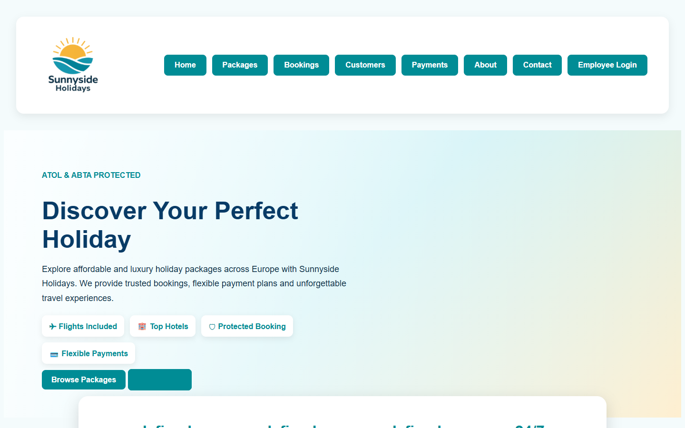
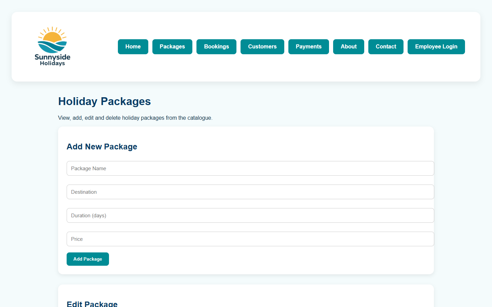

<div align="center">


<br/><br/>

# ✈️ Sunnyside Holidays

### Web Development University Project · University of Portsmouth

*A full-stack holiday booking management system built with Node.js, Express, PostgreSQL, HTML & CSS.*

<br/>

**🌐 [Live Demo → sunnyside-holidays-up.pplx.app](https://sunnyside-holidays-up.pplx.app)**

<br/>

| 🖥️ Frontend | ⚙️ Backend | 🗄️ Database | 📄 Pages | 🔗 API Routes |
|:-----------:|:---------:|:-----------:|:--------:|:-------------:|
| HTML · CSS · JS | Node.js · Express | PostgreSQL | 10 | 5 REST endpoints |

</div>

---

## 📸 Preview

### Home Page


---

### Packages Page


---

## 📌 Table of Contents
- [Project Overview](#-project-overview)
- [Features](#-features)
- [Tech Stack](#-tech-stack)
- [Database Schema](#-database-schema)
- [API Endpoints](#-api-endpoints)
- [Pages](#-pages)
- [Project Structure](#-project-structure)
- [Setup & Run](#-setup--run)
- [Author](#-author)

---

## 🔍 Project Overview

**Sunnyside Holidays** is a full-stack holiday booking web application developed as a Web Development module project at the **University of Portsmouth**. The system allows customers to browse holiday packages, make bookings, and manage payments — while employees can log in to manage customers, bookings, and admin tasks.

The application is built on a relational PostgreSQL database with a RESTful Node.js/Express backend and a multi-page HTML/CSS frontend.

---

## ✨ Features

- 🏖️ **Holiday Packages** — Browse available packages with destination, duration, and pricing
- 👥 **Customer Management** — View, add, and manage customer records
- 📅 **Bookings System** — Create and track holiday bookings with travel and return dates
- 💳 **Payments Tracking** — Monitor payment status and instalment records
- 🔐 **Employee Login** — Role-based access for staff with admin panel
- 📞 **Contact Page** — Customer enquiry form
- ℹ️ **About Page** — Company information (ATOL & ABTA Protected)

---

## 🛠️ Tech Stack

| Layer | Technology |
|-------|-----------|
| Frontend | HTML5, CSS3, Vanilla JavaScript |
| Backend | Node.js, Express.js v5 |
| Database | PostgreSQL |
| ORM/Driver | `pg` (node-postgres) |
| Middleware | `cors`, `body-parser` |

---

## 🗄️ Database Schema

The application uses a fully normalised relational PostgreSQL database with **10 tables**:

```
branch      → Company branches (name, city, address, contact)
role        → Employee roles with permission flags
employee    → Staff records linked to branch and role
customer    → Customer profiles (name, email, DOB, address)
partner     → Third-party partners (hotels, insurers)
hotel       → Hotel details linked to partners
flight      → Flight info (airline, airports, departure, duration)
package     → Holiday packages (hotel + flight + price)
insurance   → Insurance policies linked to partners
booking     → Bookings linking customer, employee, package, insurance
payment     → Payment records with instalment tracking
```

### Entity Relationships

```
branch ──< employee >── role
partner ──< hotel
partner ──< insurance
hotel ──< package >── flight
customer ──< booking >── employee
booking ──> package
booking ──> insurance (optional)
booking ──< payment
```

---

## 🔗 API Endpoints

Base URL: `http://localhost:3000`

| Method | Endpoint | Description |
|--------|----------|-------------|
| `GET` | `/users` | Fetch all users |
| `GET` | `/user/:id` | Fetch a specific user by ID |
| `POST` | `/user` | Create a new user |
| `PUT` | `/user/:id` | Update a user's name and email |
| `DELETE` | `/user/:id` | Delete a user by ID |

---

## 📄 Pages

| Page | File | Description |
|------|------|-------------|
| Home | `index.html` | Landing page with hero section and package highlights |
| Packages | `packages.html` | Browse all available holiday packages |
| Bookings | `bookings.html` | View and manage customer bookings |
| Customers | `customers.html` | Customer management table |
| Payments | `payments.html` | Payment records and instalment tracking |
| Employee Login | `employee-login.html` | Staff authentication page |
| Admin | `admin.html` | Admin dashboard for staff |
| About | `about.html` | Company info (ATOL & ABTA protected) |
| Contact | `contact.html` | Customer enquiry form |

---

## 📁 Project Structure

```
web-dev-university-project/
│
├── 📂 client/                    # Frontend — served as static files
│   ├── index.html                # Home page
│   ├── packages.html             # Holiday packages
│   ├── bookings.html             # Bookings management
│   ├── customers.html            # Customer records
│   ├── payments.html             # Payments tracking
│   ├── employee-login.html       # Staff login
│   ├── admin.html                # Admin panel
│   ├── about.html                # About page
│   ├── contact.html              # Contact form
│   ├── style.css                 # Global stylesheet
│   └── images/                   # Logo and destination images
│
├── 📂 db/
│   ├── create-tables.sql         # Database schema (10 tables)
│   └── seed-data.sql             # Sample data for testing
│
├── 📂 do-not-edit/               # Provided setup utilities
│   ├── db.js                     # Database connection helper
│   ├── setup-db.js               # Initialises the database
│   └── cleanup-db.js             # Drops all tables
│
├── 📂 screenshots/               # Website preview images
│
├── server.cjs                    # Express server & REST API
├── db-config.js                  # PostgreSQL connection config
├── package.json                  # Node.js dependencies
└── README.md
```

---

## ⚙️ Setup & Run

### Prerequisites
- [Node.js](https://nodejs.org/) v18+
- [PostgreSQL](https://www.postgresql.org/) v14+

### 1. Clone the repository
```bash
git clone https://github.com/tasnem-tech/web-dev-university-project.git
cd web-dev-university-project
```

### 2. Install dependencies
```bash
npm install
```

### 3. Configure the database
Edit `db-config.js` with your PostgreSQL credentials:
```js
user: 'postgres',
host: 'localhost',
database: 'mydb',
password: 'your_password',
port: 5432,
```

### 4. Set up the database
```bash
# Create tables
psql -U postgres -d mydb -f db/create-tables.sql

# Load sample data
psql -U postgres -d mydb -f db/seed-data.sql
```

### 5. Start the server
```bash
node server.cjs
```

### 6. Open in browser
```
http://localhost:3000
```

---

## 👩‍💻 Author

<div align="center">

**Tasnem Islam Prome**
BSc Computer Science · London, UK
University of Portsmouth

[](https://github.com/tasnem-tech)

</div>

---

<div align="center">

*Built as part of the Web Development module — BSc Computer Science, University of Portsmouth*

**🌐 [Live Demo → sunnyside-holidays-up.pplx.app](https://sunnyside-holidays-up.pplx.app)**

</div>
